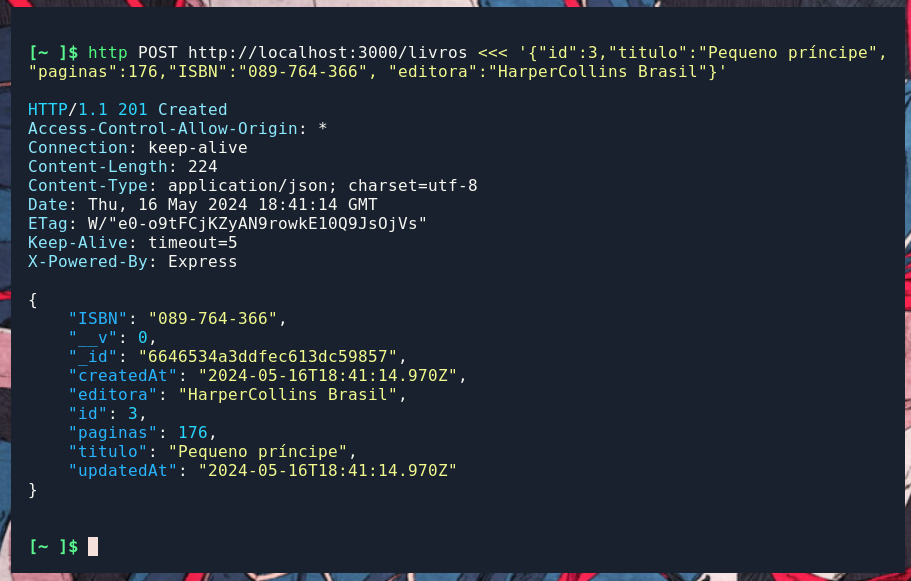
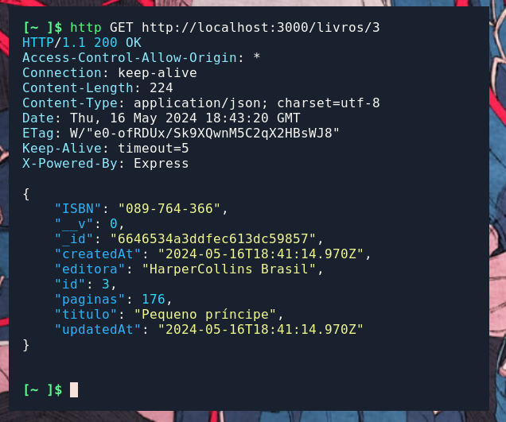
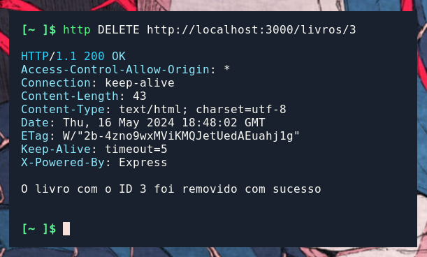

<b>API</b> local rodando na porta 3000

usando mongodb(db assíncrona) como banco de dados 

## REST:(GET, POST, PUT/PATCH, DELETE)

### cadastro de livro

### listagem de livro

### listagem de um livro

### edição de livro

### remoção de livro

